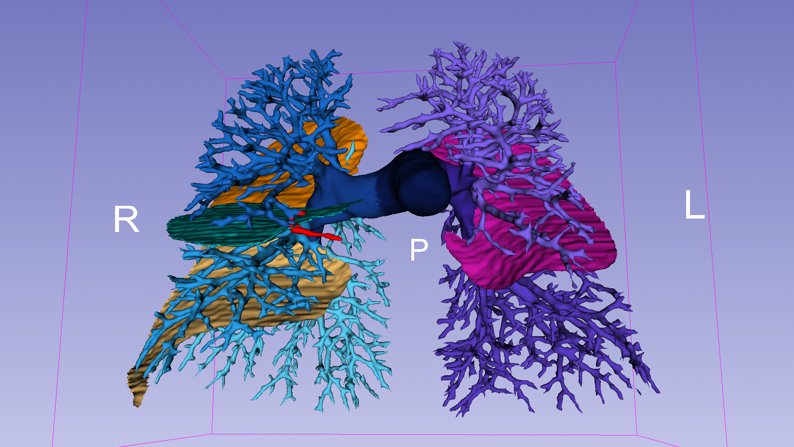

# VE-SCAN

**VE-SCAN** — a toolkit for vessel tree cutting, anatomical branch
assignment, and crossing-vessel characterization.

Given a set of vessel segmentations (arteries, veins, pulmonary airways) as
input, VE-SCAN turns the raw vessel tree into a fully labeled anatomical
graph. Starting from a 3D surface or directly from a volumetric
segmentation, it:

- builds a **hierarchical centerline tree** (trunk → bifurcations →
  branches) using VMTK's centerline extraction,
- assigns every branch/bifurcation to its corresponding **anatomical
  segment** (lobar bronchus/artery/vein, main trunk, ...),
- detects **crossing vessels** — branches that cross into a neighbouring
  pulmonary lobe — together with the **interlobar fissures** they cross,
- **cuts the vessel tree** to a chosen number of generations.

Everything is driven by a single JSON config file, for one patient or an
entire dataset processed in parallel, using the `vtk` + `vtkvmtk` libraries
directly.

## Table of contents

- [Overview](#overview)
- [Installation](#installation)
- [Quick start](#quick-start)
- [Experiment configuration (JSON)](#experiment-configuration-json)
- [Visualizing results in 3D Slicer](#visualizing-results-in-3d-slicer)
- [Repository layout](#repository-layout)
- [The pipeline in detail (stages 0-11)](#the-pipeline-in-detail-stages-0-11)
- [main.py and the vescan package](#mainpy-and-the-vescan-package)
- [Important conventions](#important-conventions)

## Overview

Starting from a raw surface exported from a segmentation (or directly from a
segmentation volume), VE-SCAN builds a **hierarchical centerline tree**
(trunk → bifurcations → branches), including:

- optional conversion from a volumetric segmentation to a closed surface,
- automatic detection of the vessel's endpoints,
- extraction of both a fast approximate network and an accurate VMTK
  centerline,
- construction of the authoritative bifurcation graph (VMTK topology, not
  spatial heuristics),
- cutting the tree to a chosen number of generations,
- clipping the original vessel surface at the cut,
- per-branch surface labeling, for visualization,
- assigning each branch/bifurcation to the pulmonary lobe(s) it reaches
  ("lobe reachability"),
- classifying each branch/bifurcation into a precise medical anatomical
  segment (trachea/bronchi, pulmonary trunk/arteries, venous confluence/veins),
- detecting **crossing vessels** — branches that cross an interlobar
  fissure into a neighbouring lobe — and classifying each one as
  interlobar or translobar.

Each stage is a plain Python module under `vescan/stages/`, run
in-process (no subprocess/shell involved) by `vescan/orchestrator.py`,
which in turn is called once per patient/structure by `vescan/batch.py`
- for either a single patient or a whole dataset processed in parallel. A
single JSON config file drives everything: which stages run, every tuning
parameter, and whether to process one patient or many. **`main.py` itself
takes no other input than that config file.**

## Installation

The pipeline requires a conda environment with **VTK + a VMTK build with a
working Python wrapping** (`from vmtk import vtkvmtk...`), plus `pyfqmr`
(decimation) and `SimpleITK` (segmentation conversion). `main.py` runs every
stage **in-process**, so it must itself be launched from within that
environment (see [Quick start](#quick-start)).

Follow **[BUILD_GUIDE.md](BUILD_GUIDE.md)** for the complete steps, verified
end-to-end on macOS (osx-arm64) — it creates the conda environment, installs
VTK 9.5.2 / ITK 5.4.6 from conda-forge, and builds/installs VMTK. In short:

```bash
conda create -n vescan python=3.11 -y
conda activate vescan
conda install -n vescan -c conda-forge "vtk=9.5.2" "itk=5.4.6" "libitk-devel=5.4.6" cmake compilers -y
pip install pyfqmr SimpleITK

cmake -S vmtk -B vmtk-build-dir -DVMTK_USE_SUPERBUILD=OFF \
  -DVTK_DIR=$CONDA_PREFIX/lib/cmake/vtk-9.5 -DITK_DIR=$CONDA_PREFIX/lib/cmake/ITK-5.4 \
  -DVMTK_PYTHON_VERSION=python3.11 -DPython3_EXECUTABLE=$CONDA_PREFIX/bin/python3.11 \
  -DPython3_ROOT_DIR=$CONDA_PREFIX -DPython3_FIND_STRATEGY=LOCATION \
  -DBUILD_SHARED_LIBS=ON -DCMAKE_BUILD_TYPE=Release
LIBRARY_PATH=$CONDA_PREFIX/lib cmake --build vmtk-build-dir -j$(sysctl -n hw.ncpu)
cmake --install vmtk-build-dir --prefix "$CONDA_PREFIX"
```

**Warning**: PyPI wheels for `vtk`/`itk` (`pip install vtk itk`) are
runtime-only and cannot be used to compile `vtkVmtk` — always use the
conda-forge packages instead. BUILD_GUIDE also documents the real issues hit
along the way (non-obvious CMake flags, linker flag overrides on macOS, a
wrong default install path, etc.).

## Quick start and Experiment configuration (JSON)

`main.py`'s only input is a JSON config file - see
[`configs/pipeline_config.example.json`](configs/pipeline_config.example.json)
for every recognized key, with today's defaults and inline documentation.
Copy it, edit what you need, keep several side by side for different
datasets/experiments (see the other files in `configs/`).

```bash
cp configs/pipeline_config.example.json my_experiment.json
# edit my_experiment.json ...
python3 main.py my_experiment.json
```

Two top-level sections:

- **`batch`** — `enabled` (single patient vs. a whole dataset - see
  [Quick start](#quick-start)), `patients_root_dir`/`surfaces_root_dir`/
  `results_root_dir`, `parallel_jobs`, and `structures.{artery,veins,airways}`
  (each with its own `enabled`/`segmentation_name`) - which structure(s) to
  process, either way.
- **`pipeline`** — `stages` (one boolean toggle per stage, `0`-`11` - see
  [below](#the-pipeline-in-detail-stages-0-11)) plus one sub-section per
  stage with its own tuning parameters (e.g. `pipeline.preprocess.target_points`,
  `pipeline.cut_graph.max_generations`, `pipeline.convert.method`, ...) - see
  the stage docstrings below for what each parameter does. Interlobar
  fissures have their own switch,
  `pipeline.build_lobe_segments.extract_fissures` (default `true`), separate
  from `pipeline.stages.build_lobe_segments` which turns the whole
  patient-level stage off.

A root-level `conda_env` names the environment `main.py` expects to run in
(used in error messages, not to launch anything).

**A config file can be partial.** Any key you omit (or set to `null`) falls
back to its own built-in default - so an experiment file only needs to list
what it actually changes. Unrecognized keys print a warning (typo
protection) instead of failing silently.

**Most tuning parameters can be left at their defaults.** In practice, what
an experiment file actually needs to change is the `batch` paths (or
`pipeline.convert.segmentation_dir` for standalone stage use) and
`pipeline.cut_graph.max_generations` - how many bifurcations from the root
to keep. `pipeline.preprocess.*` can also be left at its defaults; if you do
want to tune it, the target that gives a good tree is a preprocessed surface
of around **100,000 points** (`pipeline.preprocess.target_points`).

## Visualizing results in 3D Slicer


Every `.vtk`/`.vtp` file below can be loaded directly as a Model in 3D
Slicer (or any VTK-aware viewer) and colored via **Display > Scalars >
Active Scalar**, using the matching color table from the repo root (Color
Table module > Load from file, type "Categorical Labels" for a discrete
scale).



The files that matter most for a full anatomical view of one structure
(one patient, one vessel type - artery/vein/airway):

These are the only 4 files kept directly under a structure's output folder
(everything else - the intermediate/debug files from every other stage -
lives one level down, in `supporting_files/`, out of the way):

| File | What it is | Key scalars | Color table |
|---|---|---|---|
| `anatomical_segments.vtk` | the labeled **centerline** | `AnatomicalSegment` (per branch) / `AnatomicalSegmentPoint` (per point) - precise anatomical segment, or crossing kind| `ColorTableVessels_EN.csv` (segments)|
| `branch_labeled_surface.vtk` | the full **vessel surface** | same `AnatomicalSegment(Point)` as above (merged in place by stages 9-10)| `ColorTableVessels_EN.csv` |
| `clipped_surface.vtk` | the surface **cut to N generations** | same scalars as `branch_labeled_surface.vtk` above | same as above |

**Use the `...Point` arrays for the most precise view.** `AnatomicalSegmentPoint`
is resolved per centerline point, not per branch, so a
boundary (an anatomical-segment change, a lobe crossing) shows up exactly
where it happens instead of painting an entire branch one color.

Once per patient (not per structure), `lobe_segments.vtk` (`LobeSegment_Vein`/
`_Artery`/`_Airway` + `FissureContact`/`Fissure`) and `lobe_fissures.vtk` (the
interlobar fissure sheets on their own) use `ColorTableLobesFissures_EN.csv`.

## Repository layout

```
VE-SCAN/
├── main.py                     # the entire CLI: python3 main.py config.json
│
├── vescan/
│   ├── config.py                # typed schema + loader for the JSON config
│   ├── paths.py                 # derived output file names for one pipeline run
│   ├── lobes.py                 # canonical pulmonary lobe order/side membership
│   ├── io.py                    # shared surface I/O (load/save, LPS/RAS, ...)
│   ├── crossings.py             # what a crossing vessel IS + the interlobar/translobar rule
│   │                            # (shared by stages 10 and 11, not a stage itself)
│   ├── orchestrator.py          # run_pipeline(): every stage, in-process, for one structure
│   ├── batch.py                 # dispatches to one patient or a whole batch
│   └── stages/
│       ├── convert_segmentations.py  # [0] segmentation -> closed surface
│       ├── build_lobe_segments.py    # PATIENT-level, idempotent: merges the 5 lobe surfaces
│       │                             # into one colored mesh for Slicer (not vessel-type-specific)
│       │                             # and extracts the 4 interlobar fissure sheets from them
│       ├── preprocess.py             # [1] surface preprocessing (decimation/clean/normals)
│       ├── endpoints.py              # [2] automatic endpoint detection
│       ├── network.py                # [3] approximate network extraction
│       ├── centerline.py             # [4] accurate centerline extraction (VMTK)
│       ├── build_graph.py            # [5] authoritative VMTK bifurcation graph
│       ├── cut_graph.py              # [6] cutting the tree to N generations
│       ├── clip_vessel.py            # [7] vessel surface clipping
│       ├── transfer_centerline_labels.py  # [8] transfer any centerline cell array onto a surface
│       ├── lobe_reachability.py      # [9] pulmonary lobe reachability assignment
│       ├── anatomical_segments.py    # [10] precise anatomical segment classification
│       │                             #      + CrossingId/CrossingType (via ../crossings.py)
│       └── statistics.py             # [11] crossing-vessel reporting (count, interlobar/translobar
│                                     #      kind, lobe-to-lobe type, length, fissure incidence angle)
│
├── configs/                    # experiment configs (see below), one per dataset
│   └── pipeline_config.example.json
│
├── ColorTableVessels_EN.csv       # AnatomicalSegment(Point): trunk/dx/sx/lobar segments + crossings
├── ColorTableCrossings_EN.csv     # CrossingType(Point): interlobar / translobar / unclassified
├── ColorTableLobeLabel_EN.csv     # LobeLabel(Point): which lobe a branch/point belongs to
├── ColorTableLobesFissures_EN.csv # LobeSegment_*/FissureContact/Fissure, for lobe_segments.vtk
│
├── BUILD_GUIDE.md   # verified guide to building VMTK standalone (conda, VTK 9.5.2/ITK 5.4.6)
├── Data/patient_1/  # example data (artery/vein/airway surfaces + pulmonary lobes)
├── Outputs/         # example outputs already generated by a pipeline run
│
├── vmtk/                  # VMTK source (cloned from github.com/vmtk/vmtk)
└── vmtk-build-dir/        # VMTK CMake build tree (see BUILD_GUIDE.md)
```

`vmtk/` and `vmtk-build-dir/` are VMTK's own source/build tree, needed only
to build the environment locally (see [BUILD_GUIDE.md](BUILD_GUIDE.md)); the
actual pipeline code lives entirely in `main.py` and `vescan/`.

## The pipeline in detail (stages 0-11)

Each stage is a plain Python module under `vescan/stages/`, run
in-process by the orchestrator - but also runnable standalone for debugging
one stage in isolation: `python -m vescan.stages.<name> --help`.

### [0] `convert_segmentations.py` — From segmentation to closed surface

Precedes the numbered sequence below when starting from a segmentation
volume instead of an already-exported surface. Converts a multi-label
segmentation volume into one closed surface per label: crop to the label's
bounding box + margin, iso-contour with `vtkDiscreteFlyingEdges3D` or
`vtkSurfaceNets3D`, optional decimation/smoothing, IJK→world transform,
normal recomputation - reading any format SimpleITK supports
(`.nrrd/.nii/.nii.gz/.mha/...`). One file per label value found in the
volume. **Idempotent**: a segmentation file whose expected output already
exists is skipped, so calling it once per structure per patient (as
`vescan.batch` does) only actually converts on the first call.

```
python -m vescan.stages.convert_segmentations lung_arteries.nii.gz output_dir/ --method flying-edges
```

### `build_lobe_segments.py` — Combined lobe overview + interlobar fissures (PATIENT-level, not numbered)

Unlike every other stage, this one doesn't belong to any single vessel type -
the 5 pulmonary lobe surfaces are the same regardless of whether artery,
vein or airway is being processed. Merges them into ONE mesh tagged with
three independent per-cell arrays (`LobeSegment_Vein`/`_Artery`/`_Airway`,
each its own block of 5 values, one per lobe, on a numbering scale that
never collides with `anatomical_segments.py`'s own `AnatomicalSegment`
values) - load once in Slicer and switch Active Scalar between the three
instead of juggling three separate lobe files. `pipeline.stages.
build_lobe_segments` calls it once per patient (still invoked from every
structure's own `run_pipeline()` call, like stage 0 - **idempotent**, skips
if its output already exists), saving next to the lobe surfaces themselves
rather than inside any structure's own `final_export_<structure>/`.

**Interlobar fissures.** The same stage also extracts the pulmonary fissures,
which need no extra input because they are already *in* these lobe surfaces:
adjacent lobes come from one TotalSegmentator label map, so marching cubes
emits **coincident** triangles on their shared boundary. The area measured
from either side agrees to within 0.1% (7003.3 vs 7002.8 mm² on R01-091), and
the selection sits on a plateau rather than a slope (12.3% of RUL's points
within 0.5 mm, 13.4% within 2.0 mm), so the 1 mm tolerance is a guard against
sub-voxel jitter, not a tuning knob.

There are **four contact surfaces forming three anatomical fissures** — the
right oblique fissure separates RLL from *both* RUL and RML, so it appears as
two contacts. Every other lobe pair measures 0.0 mm² (the two lungs don't
touch), so those four are the complete set. Two per-cell arrays, since
neither is derivable from the other at cell level:

| array | values |
|---|---|
| `FissureContact` | 60 RUL\|RML, 61 RUL\|RLL, 62 RML\|RLL, 63 LUL\|LLL |
| `Fissure` | 70 horizontal right, 71 oblique right (= 61+62), 72 oblique left |

`0` in either means "not a fissure cell". Colors:
[`ColorTableLobesFissures_EN.csv`](ColorTableLobesFissures_EN.csv), which
covers every array on `lobe_segments.vtk` - `LobeSegment_*` (30-54) as well
as `FissureContact`/`Fissure` (60-72).

Two outputs: `lobe_segments.vtk` carries the fissure arrays alongside the
`LobeSegment_*` ones (fissure cells appear **twice** there, once per lobe,
since both copies are coincident), while `lobe_fissures.vtk` holds the
fissure sheets **alone, deduplicated to one copy each** — that second file is
the one to use as a geometric object.

Two caveats worth reading before using the result:

- **The fissure is a curved sheet, not a plane.** Least-squares plane fits
  leave an RMS of 1.4–5.8 mm and peak deviations of 5–16 mm. The legend JSON
  reports the fitted plane (centroid/normal/RMS) as a *descriptor only* — use
  the mesh, not the plane, to decide which side of a fissure something is on,
  or everything within ~1 cm of it (exactly the crossing vessels of stage 11)
  gets misclassified.
- **This is the segmentation's fissure, not the CT's.** Where a fissure is
  anatomically incomplete, TotalSegmentator still closes the lobe boundary
  with an interpolated surface, so the extracted sheet is always complete
  even when the patient's own fissure is not.

```
python -m vescan.stages.build_lobe_segments lobe_segments.vtk \
    --lobe RUL=lung_upper_lobe_right.vtk --lobe RML=lung_middle_lobe_right.vtk \
    --lobe RLL=lung_lower_lobe_right.vtk --lobe LLL=lung_lower_lobe_left.vtk \
    --lobe LUL=lung_upper_lobe_left.vtk --legend-output lobe_segments.json \
    --fissures-output lobe_fissures.vtk
```

Add `--no-fissures` to skip the extraction (it costs ~2.5 min per patient,
eight point-to-surface distance passes over the full-resolution lobe meshes)
- or `pipeline.build_lobe_segments.extract_fissures: false` in the config.
The three output paths come from `paths.LobeOverviewPaths`, the patient-level
counterpart of `PipelinePaths`.

### [1] `preprocess.py` — Surface preprocessing

Prepares a raw surface for centerline extraction: **decimation** (via
`pyfqmr`'s Fast-Quadric-Mesh-Simplification algorithm), clean, triangulation,
optional linear subdivision, consistent normal recomputation. By default it
keeps only the largest connected component (segmentations frequently carry
disconnected debris/islands that would otherwise attract the automatic start
point).

```
python -m vescan.stages.preprocess input.vtk output_preprocessed.vtk --target-points 5000
```

### [2] `endpoints.py` — Automatic endpoint detection

Automatic endpoint detection: extracts an approximate network
(`vtkvmtkPolyDataNetworkExtraction`) and derives its endpoints from it
(points with only one adjacent cell), picking as the start point the one
with the largest vessel radius (or the closest one to `--start-point` if
given). Automatically handles the **LPS/RAS** conversion (see
[Conventions](#important-conventions)). Output: a Markups `.mrk.json`
file (viewable directly in 3D Slicer) with all endpoints, the first one
being the start point.

```
python -m vescan.stages.endpoints preprocessed.vtk endpoints.mrk.json
```

### [3] `network.py` — Approximate network extraction

Fast, approximate network extraction (not the real VMTK centerline, see
stage 4 below): per-point Radius/Topology/Marks arrays and, if enabled,
Length/Curvature/Torsion/Tortuosity/Frenet* arrays. Optionally also writes a
per-branch Markups curve (`--network-curve`).

```
python -m vescan.stages.network preprocessed.vtk endpoints.mrk.json network.vtk --network-curve network_curve.mrk.json
```

### [4] `centerline.py` — Accurate centerline extraction

The real VMTK centerline (`vtkvmtkPolyDataCenterlines`), slower but accurate
than the approximate network of stage 3: produces the centerline model,
Voronoi diagram, per-branch curve, and per-branch properties. The raw
centerline model itself is only ever saved if extraction FAILS (0 points) -
as a diagnostic artifact, not a routine
output - since nothing downstream reads it (see `run()`'s docstring). Also
produces a "merged"/branch-split version (GroupIds/CenterlineIds/TractIds/
Blanking) used internally to compute per-branch properties, and a CSV with
AverageRadius/Length/Curvature/Torsion/Tortuosity per branch. Can also save
its own pre-merge branch-split output (`--split-output`) for stage 5 to
reuse directly, skipping its otherwise redundant re-run of the same
expensive filter (the orchestrator wires this up automatically).

```
python -m vescan.stages.centerline preprocessed.vtk endpoints.mrk.json centerline_debug.vtk \
    --voronoi-output voronoi.vtk --merged-output centerline_branches_raw.vtk \
    --properties-csv branch_properties.csv --centerline-curve branch_curves.mrk.json
```

### [5] `build_graph.py` — Authoritative bifurcation graph

The conceptually "heaviest" stage: uses `vtkvmtkCenterlineBranchExtractor` +
`vtkvmtkCenterlineUtilities` to derive the tree's **authoritative
topology** — not a spatial-clustering heuristic (an earlier attempt based on
a spatial tolerance left ~20% of branches "unreachable"). Each group (branch
or bifurcation) is uniquely identified by a `GroupId`; parent→child adjacency
is found by matching `TractIds` on the same `CenterlineId` — genuine
topological adjacency, not a guess. Groups with no upstream predecessor are,
unambiguously, the tree's root(s).

Output: one `.vtk` model per branch/bifurcation in a dedicated directory,
Markups curves, and a single branch tree file (`--split-output`,
`05_branch_tree.vtk`) that is BOTH the branch-split centerline (degenerate
stub tracts removed, still carrying the raw GroupIds/CenterlineIds/TractIds/
Blanking/Radius arrays - so it doubles as the cache that lets a later run
skip re-running `vtkvmtkCenterlineBranchExtractor`, confirmed ~15-20 minutes
on a dense centerline) AND a per-group geometry+topology summary (friendly
GroupId/IsBifurcation/Generation/Length/AverageRadius arrays) - one file
instead of the three separate, largely-overlapping ones (raw split, cleaned
split, combined model) earlier versions of this stage produced. A
`--graph-output` JSON carries the piece none of the above do: the
nodes/edges/roots themselves.

```
python -m vescan.stages.build_graph raw_centerline.vtk branch_models_dir/ \
    --curve-output branch_tree_curves.mrk.json --bifurcation-output bifurcation_points.mrk.json \
    --split-output branch_tree.vtk --graph-output branch_tree_topology.json \
    --min-branch-length 1.0
```

(`raw_centerline.vtk` here means the UN-split centerline - `vtkvmtkPolyDataCenterlines`' raw output, before `vtkvmtkCenterlineBranchExtractor` runs; NOT stage 4's own `centerline_branches_raw.vtk`, which has already been through `vtkvmtkMergeCenterlines` and lost the per-cell CenterlineId/TractId precision this stage's adjacency lookup needs - see `build_graph.py`'s own module docstring. Feed it stage 4's `--split-output` instead, if you have it, to skip re-running the branch extractor here.)

### [6] `cut_graph.py` — Cutting the tree to N generations

Works **exclusively** from stage 5's already-saved outputs (the topology
JSON + the branch tree file) — no new VMTK run needed. Cuts the tree,
keeping only the groups within `--max-generations` bifurcations from the
root, and computes the cut points (the last point of the kept group
immediately upstream of a dropped one).

```
python -m vescan.stages.cut_graph branch_tree_topology.json branch_tree.vtk cut_centerline.vtk \
    --max-generations 6 --cut-points-output cut_points.mrk.json
```

### [7] `clip_vessel.py` — Vessel surface clipping

Clips the **preprocessed surface** (not just the centerline) at stage 6's
cut. A geometric approach, chosen to scale to hundreds of cut points (see
the module's docstring for the measured limitations of
`vtkvmtkPolyDataCenterlineGroupsClipper` on that scale): it computes the set difference
between the full branch-split centerline and the cut one (the dropped
groups), then for every surface point compares its distance to the "kept"
centerline vs. the "dropped" one — a triangle survives only if all three of
its points are closer to the kept side. Keeps only the largest connected
component of the result, with optional `--cap` to close the resulting holes
and `--add-flow-extensions` for flow extensions. Also transfers
GroupId/IsBifurcation/Generation/CellId straight onto the clipped surface
before saving it (`--label-arrays`, on by default - pass an empty string to
skip) - the branch tree file is already loaded here anyway, so the output is
already the labeled clipped surface with no extra stage/file needed.

```
python -m vescan.stages.clip_vessel preprocessed.vtk branch_tree.vtk cut_centerline.vtk clipped_surface.vtk --cap
```

### [8] `transfer_centerline_labels.py` — Transfer centerline labels onto a surface

Transfers cell-data arrays from a centerline model onto a surface (full or
clipped), using the centerline cell that is geometrically closest to each
surface point (`vtkStaticCellLocator`, continuous along the whole polyline,
no "staircase" bias). Completely generic over which arrays get transferred -
used for branch/bifurcation labels (default
`GroupId,IsBifurcation,Generation,CellId`), lobe reachability arrays, and
anatomical segment labels alike; only the `--arrays` list and the input
centerline file differ each time. Used to color branches/lobes/segments in
Slicer (Display > Scalars). The orchestrator runs this stage against the
FULL surface only (`branch_labeled_surface.vtk`) - the clipped surface
gets its branch labels directly from stage 7 instead (see above), and stage
9 enriches both files further IN PLACE rather than writing new copies.

```
python -m vescan.stages.transfer_centerline_labels preprocessed.vtk branch_tree.vtk branch_labeled_surface.vtk --arrays GroupId,IsBifurcation,Generation,CellId
```

### [9] `lobe_reachability.py` — Pulmonary lobe reachability

Assigns to every branch/bifurcation of the tree the pulmonary lobe(s) it
**reaches downstream**, not just the ones it happens to sit spatially inside.
Two-stage algorithm:

1. **Spatial seeding** (not the final answer): every non-bifurcation
   ("branch") group's own points are tested against every lobe surface with
   `vtkSelectEnclosedPoints`; it's directly assigned to a lobe when at least
   a minimum fraction (`--containment-threshold`, default 0.1, deliberately
   kept low) of its points is contained inside it.
2. **Graph reachability** (the actual algorithm): the topology JSON is
   walked bottom-up from the root(s), so a group's reachable lobes = its own
   direct lobe(s) UNION the reachable lobes of every one of its downstream
   children. A group ending up with more than one reachable lobe is,
   unambiguously, a shared proximal trunk (e.g. the main pulmonary artery)
   feeding more than one lobe further downstream — something step 1 alone
   could never detect (proximal trunks sit in the mediastinum, outside every
   lobe surface).

Output: `NumReachableLobes`, `LobeMask` (bitmask) and one `Reaches_<LOBE>`
array per lobe (0/1/2, where 2 = shared trunk) on the branch tree file, plus
a legend JSON and, optionally, a standalone centerline per lobe
(`--extract-lobe NAME=path.vtk`, directly reusable as input to
`vescan.stages.clip_vessel` to carve out that single lobe's
feeding-artery surface). When run in the same process as stage 10 (the
normal orchestrator/batch path), its result is handed to stage 10 directly
in memory - no JSON/VTK round-trip. In the orchestrator itself, these same
arrays (plus `LobeLabel`/`LobeLabelPoint`) are also merged, in place, into
`branch_labeled_surface.vtk` and `clipped_surface.vtk` - not written
as separate files (see [Visualizing results in 3D Slicer](#visualizing-results-in-3d-slicer)
above). `LobeLabel` and `LobeLabelPoint` are a separate, purely
local/positional classification (no subtree-union): `LobeLabel` colors each
group by where its own points sit, tainting every downstream descendant once
the vessel has crossed a lobe boundary once, so a group doesn't get painted
as a shared trunk just because some distant descendant crosses into another
lobe; `LobeLabelPoint` is the per-point version, with no propagation at all,
letting you locate the exact point (and arc length) where a vessel
enters/leaves a lobe.

With **N** = number of `--lobe` surfaces passed:

| Array | Level | Range | Meaning |
|---|---|---|---|
| `LobeMask` | group | `0` – `2^N - 1` | bitmask, bit *i* set = subtree reaches lobeOrder[i] |
| `NumReachableLobes` | group | `0` – `N` | lobes the subtree reaches (0 = none, 1 = exclusive, >1 = shared trunk) |
| `Reaches_<LOBE>` (one per lobe) | group | `0`, `1`, `2` | 0 = doesn't reach, 1 = reaches exclusively, 2 = reaches + shared with another lobe |
| `LobeLabel` | group | `0` – `N + 2` | 0 = none/disconnected fragment, 1..N = exclusive to lobeOrder[label-1], N+1 = trunk (outside every lobe), N+2 = crossing point or downstream of one |
| `LobeLabelPoint` | point | `0` – `N + 2` | same scale as `LobeLabel` but per individual centerline point, no downstream propagation; N+2 = this exact point tests inside more than one lobe (rare, only at fissure overlaps) |

```
python -m vescan.stages.lobe_reachability branch_tree_topology.json branch_tree.vtk lobe_reachability.vtk \
    --lobe RUL=lung_upper_lobe_right.vtk --lobe RML=lung_middle_lobe_right.vtk \
    --lobe RLL=lung_lower_lobe_right.vtk --lobe LUL=lung_upper_lobe_left.vtk \
    --lobe LLL=lung_lower_lobe_left.vtk \
    --containment-threshold 0.1 --legend-output lobe_reachability.json --extract-lobe RUL=centerline_RUL.vtk
```

### [10] `anatomical_segments.py` — Precise anatomical segment classification

Sits "above" stage 9's per-lobe output, reusing its already graph-derived
results rather than re-walking the tree: classifies every branch/bifurcation
into a precise medical anatomical segment - three tiers, matching real
anatomy, not just left/right (e.g. for arteries: Tronco polmonare → Arteria
polmonare destra/sinistra → one of the 5 lobar arteries). All three vessel
types (`--vessel-type artery/vein/airway`) share ONE unified numeric scale
(fixed 9-value blocks per type) so they never collide when loaded/colored
together - see [`ColorTableVessels_EN.csv`](ColorTableVessels_EN.csv) for a
matching Slicer color table. In the orchestrator itself, the resulting
`AnatomicalSegment` array is merged, in place, into
`branch_labeled_surface.vtk` and `clipped_surface.vtk` - not written
as separate files (see [Visualizing results in 3D Slicer](#visualizing-results-in-3d-slicer)
above).

**Crossings are split in two, inside `AnatomicalSegment` itself.** A vessel
carrying the crossing label is either **interlobar** (runs along the fissure,
grazing it) or **translobar** (transects it and stays on the other side) — see
[`crossings.py`](vescan/crossings.py) below for the rule. Each kind
gets its own value in `AnatomicalSegment` *and* `AnatomicalSegmentPoint`, so a
single Active Scalar in Slicer shows both what a vessel is and which kind of
crossing it makes:

| | interlobar | translobar |
|---|---|---|
| airway | 73 | 74 |
| artery | 75 | 76 |
| vein | 77 | 78 |

They sit in their own block above everything else in use, rather than
widening the 9-value blocks: widening would renumber artery (10-18) and vein
(20-28), invalidating every existing output and legend, and would collide
with `LobeSegment_*` at 30-54.

The plain `9`/`18`/`28` is **not retired** — it keeps exactly the meaning it
always had, *crossing, kind not determined*, which is what a run without the
fissure surface still produces. An old file therefore stays correctly
readable and a new one is strictly more informative.

Colors are in [`ColorTableVessels_EN.csv`](ColorTableVessels_EN.csv), chosen
so **interlobar keeps the colour crossings have today** (yellow/amber) and
translobar gets one picked to contrast with *its own* vessel family — rose
against the airway greens, red against the artery blues, spring teal against
the vein reds. So the single coloured zone you see now splits in place: what
stays yellow is interlobar, what changes colour is translobar.

**Crossing-vessel grouping.** Given `--topology` and `--fissures`, this stage
also writes four arrays that make the grouping legible — `CrossingId` /
`CrossingIdPoint` (which crossing vessel a cell or point belongs to, `0` for
none) and `CrossingType` / `CrossingTypePoint` (`1` interlobar, `2`
translobar, `3` unclassified). The whole run of an interlobar vessel shares
**one** id, so it reads as a single object in Slicer instead of a string of
separately-coloured branches, and the ids match the `crossing` column of
stage 11's CSV. Colors: [`ColorTableCrossings_EN.csv`](ColorTableCrossings_EN.csv)
for `CrossingType`; `CrossingId` is an arbitrary index, so any continuous
lookup table does.

The classification itself lives in
[`crossings.py`](vescan/crossings.py) — see the section above. Without
`--topology` the output is exactly as it was before; without `--fissures`
crossings are still grouped but left `unclassified`. Counting tagged points
will not reproduce the CSV's `points` column, and shouldn't: these arrays tag
*every* cell of a crossing group, because a branch left half-uncoloured reads
as a bug, while the measurement deliberately walks one representative cell per
group. Display wants every copy, measurement wants exactly one.

```
python -m vescan.stages.anatomical_segments lobe_reachability.json lobe_reachability.vtk anatomical_segments.vtk \
    --vessel-type artery --legend-output anatomical_segments.json \
    --topology 05_branch_tree_topology.json --fissures ../../vtk/lobe_fissures.vtk
```

### `crossings.py` — What a crossing vessel *is* (shared, not a stage)

Stages 10 and 11 both need the same answer to "which groups form one crossing
vessel, and what kind is it", so that answer lives in one module
([`vescan/crossings.py`](vescan/crossings.py)) that neither
stage owns and nothing writes files from. Stage 10 labels the result onto the
centerline; stage 11 reports it.

**Two kinds of crossing**, and they are different anatomical objects:

| | behaviour | signature |
|---|---|---|
| **translobar** | goes through the fissure and stays on the other side | steep piercings |
| **interlobar** | runs *along* the fissure, drifting in and out of the neighbour | several piercings, all shallow |

Both count as **one** crossing vessel. An interlobar vessel is not several
crossings sharing a branch — it is one vessel travelling in the interlobar
plane, and its multiple contact points are a property to measure, not an
artifact to collapse.

The rule, and the data that fixed it (13 crossing vessels, 3 patients):

```
interlobar  <=>  >= 2 piercings  AND  median incidence angle < 30 deg

                   piercings   median angle
  interlobar           5           15.0
  interlobar           2            4.1
  interlobar           4            1.6
  -------------------------------------- threshold sits here
  translobar           2           39.4     angles [13.9, 64.9]
  translobar           1       18.7 .. 79.6
```

A single piercing is translobar by construction — the vessel went through
once and stayed. The threshold only ever decides multi-piercing cases, where
the margin is 15.0 against 39.4: a factor of 2.6, so 30° is the middle of a
wide gap rather than a tuned number.

**Tried and rejected:** "fraction of the crossing's length running within 5 mm
of the fissure" sounds like the natural measure of *runs along it* and does
**not** separate the two — a short translobar crossing scores 100% simply by
being short, while the longest interlobar one scores 19.6% by wandering. The
angle is the discriminator.

**Angle convention:** to the fissure *plane*, 0–90°, unsigned. 0° = runs along
the fissure, 90° = pierces perpendicular. Unsigned deliberately: the fissure
sheets are extracted from one lobe's side, so their normals are not
consistently oriented between the four contacts, and a signed angle would
silently depend on which lobe happened to be "A" in that pair.

The local plane comes from a 5 mm patch of the fissure mesh, never the global
fit: the global plane leaves 1.4–5.8 mm RMS, the patch leaves 0.06–0.31 mm.
Locally the sheet really is planar.

**Ill-conditioning, stated because it is real:** at grazing incidence the
tangent direction is indeterminate, and the same piercing moves between 5.7°
and 0.8° depending on the window used. Above ~15° the angle is stable to
within a few degrees across every window and patch radius tried. Hence the
*median* drives the decision, and anything under 10° is flagged `grazing`
rather than reported as a precise number.

### [11] `statistics.py` — Crossing-vessel reporting

Answers five questions per structure, and nothing else: **how many crossing
vessels there are**, **which kind each one is**, **which lobe each one goes
from and to**, **how many millimetres of centerline each one spans**, and **at
what angle it meets the fissure, how many times**. It reads only what the
stages above already wrote, so it is cheap, purely additive, and safe to
re-run on an existing output folder — which is also why the orchestrator lets
it fail without failing the run.

Output is `statistics.json` plus `statistics.csv`, the latter with **one
row per crossing vessel**, so concatenating it across patients and vessel
types is the whole aggregation step:

```
patient      structure  crossing  crossing_type  from_lobe  to_lobe  length_mm  length_to_end_mm  length_after_piercing_mm  n_piercings  angle_median_deg
LUNGx-CT011  airways
LUNGx-CT011  artery     1         translobar     RML        RUL       31.857    17.0              17.7                      1            47.57
LUNGx-CT011  artery     3         interlobar     RLL        RUL        9.264     9.3               9.9                      4             1.60
R01-091      veins      1         interlobar     RUL        RML      402.603    86.1              86.4                      5            15.03
R01-091      veins      2         translobar     RUL        RML       33.176    31.2              31.4                      1            18.73
R01-137      veins      1         interlobar                LLL+LUL  127.836    69.9              10.2                      2             4.05
```

A structure with no crossing still writes one row, carrying `n_crossings=0`
and empty crossing columns, so "none found" stays distinguishable from "never
processed". Per-piercing detail (each one's angle, fissure, local patch RMS
and vessel radius) stays in the JSON: a vessel with five piercings must not
become five rows, or every aggregation over "number of crossings" silently
counts interlobar vessels several times.

The `fissures` column is an independent cross-check, not a restatement: it
comes from which fissure sheet the centerline geometrically pierced, while
`from_lobe`/`to_lobe` come from the reachability labels on the group graph.
On all 13 crossings measured the two agree — e.g. a vessel labelled RUL→RLL
pierces contact 61, which *is* RUL|RLL.

Three measurement decisions, each forced by real data:

- **A crossing vessel is one connected run of crossing-labeled groups**,
  joined through the group graph (`05_branch_tree_topology.json`). The label
  propagates to every group downstream of the one that actually straddles a
  boundary, so counting labeled *groups* over-reports badly — 75 groups for 4
  real crossings on one patient's veins. Geometry cannot do the joining: the
  centerline's cells share no point ids (not one point of 28721 belongs to two
  cells), and rebuilding adjacency by position leaves the two traversals of a
  branch a few tenths of a millimetre apart at junctions, which splits those
  same 4 crossings into 11. Both approaches agree on the total length to the
  millimetre, which is what makes the group graph the safe choice.
- **Length is summed over each group's representative cell only** — the one
  with the most points, exactly as `build_graph.build_group_data()` picks it.
  A group's other cells are the same branch traced by other centerlines;
  walking them all inflates a tree from 9912.7 mm to 12761.4 mm. A segment
  counts only when *both* endpoints carry the label.
- **There are three lengths, not one**, because the question has three honest
  answers and collapsing them loses information:

  | column | what it measures |
  |---|---|
  | `length_mm` | the whole downstream subtree, every branch summed |
  | `length_to_end_mm` | longest single path from where the crossing label starts to a distal leaf — *how far does it still go* |
  | `length_after_piercing_mm` | the same, anchored at the fissure piercing itself |

  They diverge a lot once a crossing branches: R01-091's largest venous
  crossing totals **402.6 mm** over 58 groups and 20 leaves, while its longest
  single path is **86.1 mm**. The first is not wrong — it answers "how much
  vasculature is downstream of this crossing".

  `length_after_piercing_mm` is usually much smaller, because most piercings
  don't land on the run's root group: by the time the vessel actually meets
  the sheet, much of the labelled run is behind it (R01-137's largest venous
  crossing: 69.9 mm to the end, only 10.2 mm after its piercings). It can also
  come out a few tenths *larger*, which is not an inconsistency — the label
  boundary and the fissure mesh are the same anatomical surface reached by two
  different routes, so they agree to within the discretisation, not exactly.
- **Length is geometric, never a point count.** `curve_sampling_distance` is
  an upper bound, not a fixed step: measured spacing between consecutive
  centerline points runs from 0 to 1.001 mm, mean 0.683, median 0.747. Reading
  one point as one millimetre would overstate every length by about 45%.

Direction needs no neighbour search: the label starts mid-cell, at the very
point `LobeLabelPoint` changes value, so the origin lobe is still in the same
cell one index earlier. When the label starts at the *first* point of every
group in a run there is no pre-crossing point left to read, and `from_lobe`
comes out empty — visible on R01-137's veins above.

```
python -m vescan.stages.statistics OUTPUT_DIR --vessel-type artery \
    --fissures ../../vtk/lobe_fissures.vtk
```

Without `--fissures` the counts and lengths are unchanged and every vessel is
reported as `unclassified` — the split needs the fissure geometry, so the
stage says so rather than guessing.

## main.py and the vescan package

`main.py` is the entire CLI - it loads the config and calls
`vescan.batch.run(cfg)`, which does everything else:

- **`vescan/orchestrator.py`** (`run_pipeline()`) runs every stage
  above, in-process, for one input surface/structure - the same fixed
  file-naming convention as before, defined once in `vescan/paths.py`
  (`supporting_files/01_preprocessed.vtk`, `supporting_files/02_endpoints.mrk.json`,
  ..., `anatomical_segments.vtk`, `statistics.json`) lets any stage
  be re-run on its own (`pipeline.stages.<name>: false` for the others),
  reusing whatever already exists on disk.
- **`vescan/batch.py`** decides, from `batch.enabled`, whether to call
  `process_patient()` once (single patient, logging to both the terminal and
  its own `results_root_dir/pipeline.log`) or once per patient subfolder
  found in `batch.patients_root_dir` (batch mode, up to `batch.parallel_jobs`
  concurrently via `ProcessPoolExecutor`, each patient's output going ONLY to
  its own `pipeline.log`, appended to across re-runs). One patient (or one
  structure of one patient) failing does not stop the rest - a summary of
  successes/failures is logged at the end. See
  [`vescan/logging_config.py`](vescan/logging_config.py) for
  the logging setup either mode uses.
- **`vescan/config.py`** is the typed schema (Python dataclasses) the
  JSON config is parsed into - a typo in a key name, or a wrong value type,
  is caught with a precise error instead of being silently ignored.
- **`vescan/paths.py`** is the single place the `NN_filename.ext`
  naming convention is defined, shared by the orchestrator and batch runner.

Every stage runs **in-process** (a plain function call), not as a
subprocess - `main.py` must therefore itself be launched from within the
conda environment that has vtk/vmtk/pyfqmr installed. This is both faster
(no per-stage interpreter startup/VTK import) and lets later stages reuse an
earlier stage's already-loaded data directly in memory (see e.g. stage 4
handing its branch-split centerline to stage 5, or stage 9 handing its
result to stage 10).

## Important conventions

- **File formats**: always prefer `.vtk`/`.vtp` over `.stl` for input
  surfaces — STL stores coordinates as float32 with no explicit connectivity
  (a triangle soup), and reconstructing connectivity for coincident points
  can silently fail, spuriously splitting the mesh into disconnected
  components (see `load_surface()` in `vescan/io.py`).
- **LPS/RAS coordinates**: Slicer's live scene is always in RAS, but
  `.mrk.json` files and exported `.vtk` headers are in LPS
  (`SPACE=LPS`/`SPACE=RAS` on the second line of the legacy `.vtk`). Stages
  that depend on the coordinate system (`endpoints`, `network`, `centerline`,
  ...) automatically detect and convert this space; for `.vtp`/`.stl` files
  (which carry no such header) LPS is assumed by default, matching Slicer's
  Models module export convention.
- **GroupIds vs. GroupId**: `05_branch_tree.vtk` carries BOTH - `GroupIds`
  (with an S, native VMTK convention, from `vtkvmtkCenterlineBranchExtractor`
  itself) AND the friendly `GroupId` (singular) summary array `build_graph.py`
  adds on top (see its module docstring). `clip_vessel.py` reads the former,
  `cut_graph.py`/`lobe_reachability.py`/`transfer_centerline_labels.py` the
  latter - from the same file, so this no longer means juggling several
  files, just knowing which array name a given stage expects.
- **Computational cost**: the slowest step in the whole pipeline is
  `vtkvmtkCenterlineBranchExtractor` (confirmed ~15-20 minutes on a real
  dense centerline), used by both stage 4 (if it needs to build the merged
  centerline) and stage 5. The orchestrator already avoids running it twice
  in the same invocation (stage 4 saves its own split for stage 5 to reuse);
  across separate invocations, use `pipeline.build_graph.use_cached_split`/
  `cached_split_file` to skip it again.

